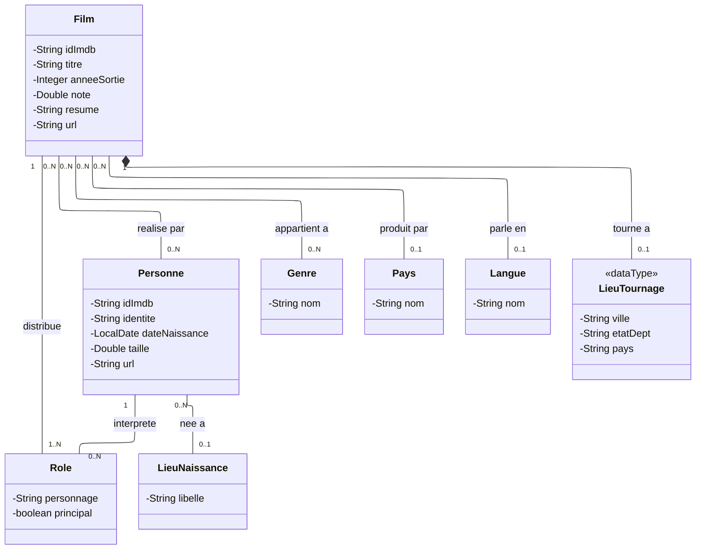
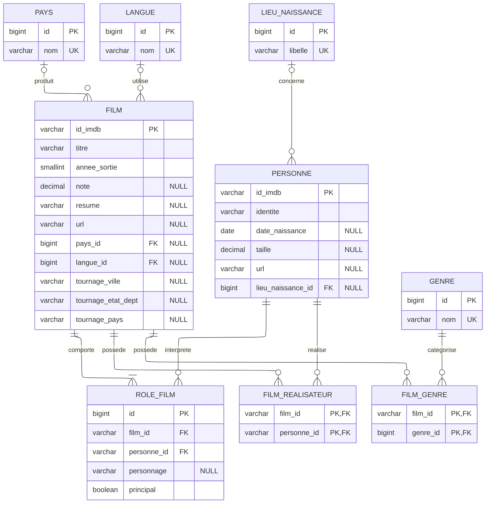

# Conception — projet Cinéma IMDb

Ce document répond à la tâche n°1 a. du projet. Il contient :

- le diagramme de classes UML représentant le modèle métier ;
- le Modèle Physique de Données représentant les tables ;
- les principaux choix de conception ;
- le script SQL MySQL/MariaDB correspondant.

La source retenue pour l'import est `films.json`.

---

## 1. Diagramme de classes UML

Dans les cardinalités, `N` signifie « plusieurs ». Le minimum `0` indique une
relation facultative dans le métier ; le MPD et le SQL traduisent ensuite cette
optionalité dans la base de données.



---

## 2. Principaux choix de conception

### Une seule entité `Personne`

Les acteurs et les réalisateurs partagent les mêmes informations, et 253 personnes
occupent les deux fonctions dans le JSON. Deux classes séparées dupliqueraient ces
personnes. La fonction exercée est donc portée par la relation avec `Film`.

### `Role` comme classe d'association

La relation entre un film et un acteur porte le nom du personnage. Elle nécessite
donc une classe propre. Le booléen `principal` est renseigné lorsque le couple
film-personne apparaît dans `castingPrincipal`. La collection
`castingPrincipal` n'est pas persistée séparément.

### Une seule année de sortie

Lorsque `anneeSortie` contient un intervalle comme `1969–1970`, seule la borne
minimale est conservée. Si plusieurs objets JSON possèdent le même identifiant
IMDb, la plus petite année rencontrée est retenue.

Les notes écrites avec un point ou une virgule sont normalisées avant conversion :
`6.3` et `6,3` produisent la même valeur numérique.

### Lieux de naissance et de tournage

Le lieu de naissance est fourni comme un texte libre non structuré. Il est donc
conservé dans un unique `libelle`, avec une ligne partagée par toutes les personnes
nées au même endroit.

Le lieu de tournage est déjà structuré en trois champs dans le JSON. Il est traité
comme un objet embarqué et ses colonnes sont placées directement dans `film` ; il
ne possède pas de table.

### Entités de référence uniques

`Pays`, `Langue`, `Genre` et `LieuNaissance` utilisent une clé technique `Long` et
une contrainte d'unicité sur leur nom ou leur libellé. Les valeurs sont nettoyées
avec `trim()` avant leur recherche ou leur insertion.

### Identifiants et URL

Les identifiants IMDb `tt…` et `nm…` sont conservés comme clés primaires naturelles
de `Film` et `Personne`. Les URL source de ces deux entités sont conservées telles
quelles. L'URL de recherche contenue dans l'objet JSON `pays` n'est pas persistée,
car aucune fonctionnalité du projet ne l'utilise.

---

## 3. Modèle Physique de Données

Légende de la notation :

- `o|` : zéro ou un ;
- `||` : exactement un ;
- `o{` : zéro à plusieurs ;
- `|{` : un à plusieurs.



Les relations film-réalisateur et film-genre sont de type plusieurs-à-plusieurs.
Elles deviennent donc les tables de jointure `film_realisateur` et `film_genre`.

La relation acteur-film possède ses propres données ; elle devient l'entité
`role_film`. Le couple `(film_id, personne_id)` est déclaré unique afin d'éviter
les doublons lors d'un nouvel import.

---

## 4. Script SQL

Le SQL précise les colonnes acceptant `NULL`. Elles correspondent aux informations
facultatives ou absentes de certaines entrées du JSON.

```sql
CREATE DATABASE IF NOT EXISTS cinema
    CHARACTER SET utf8mb4
    COLLATE utf8mb4_unicode_ci;

USE cinema;

CREATE TABLE pays (
    id BIGINT NOT NULL AUTO_INCREMENT,
    nom VARCHAR(100) NOT NULL,
    CONSTRAINT pk_pays PRIMARY KEY (id),
    CONSTRAINT uk_pays_nom UNIQUE (nom)
) ENGINE = InnoDB;

CREATE TABLE langue (
    id BIGINT NOT NULL AUTO_INCREMENT,
    nom VARCHAR(50) NOT NULL,
    CONSTRAINT pk_langue PRIMARY KEY (id),
    CONSTRAINT uk_langue_nom UNIQUE (nom)
) ENGINE = InnoDB;

CREATE TABLE genre (
    id BIGINT NOT NULL AUTO_INCREMENT,
    nom VARCHAR(50) NOT NULL,
    CONSTRAINT pk_genre PRIMARY KEY (id),
    CONSTRAINT uk_genre_nom UNIQUE (nom)
) ENGINE = InnoDB;

CREATE TABLE lieu_naissance (
    id BIGINT NOT NULL AUTO_INCREMENT,
    libelle VARCHAR(150) NOT NULL,
    CONSTRAINT pk_lieu_naissance PRIMARY KEY (id),
    CONSTRAINT uk_lieu_naissance_libelle UNIQUE (libelle)
) ENGINE = InnoDB;

CREATE TABLE film (
    id_imdb VARCHAR(10) NOT NULL,
    titre VARCHAR(150) NOT NULL,
    annee_sortie SMALLINT NOT NULL,
    note DECIMAL(3,1) NULL,
    resume VARCHAR(500) NULL,
    url VARCHAR(100) NULL,
    pays_id BIGINT NULL,
    langue_id BIGINT NULL,
    tournage_ville VARCHAR(150) NULL,
    tournage_etat_dept VARCHAR(100) NULL,
    tournage_pays VARCHAR(100) NULL,
    CONSTRAINT pk_film PRIMARY KEY (id_imdb),
    CONSTRAINT ck_film_note CHECK (note IS NULL OR note BETWEEN 0 AND 10),
    CONSTRAINT fk_film_pays FOREIGN KEY (pays_id)
        REFERENCES pays (id) ON DELETE SET NULL,
    CONSTRAINT fk_film_langue FOREIGN KEY (langue_id)
        REFERENCES langue (id) ON DELETE SET NULL
) ENGINE = InnoDB;

CREATE INDEX idx_film_annee_sortie ON film (annee_sortie);
CREATE INDEX idx_film_titre ON film (titre);
CREATE INDEX idx_film_pays ON film (pays_id);
CREATE INDEX idx_film_langue ON film (langue_id);

CREATE TABLE personne (
    id_imdb VARCHAR(10) NOT NULL,
    identite VARCHAR(100) NOT NULL,
    date_naissance DATE NULL,
    taille DECIMAL(3,2) NULL,
    url VARCHAR(50) NULL,
    lieu_naissance_id BIGINT NULL,
    CONSTRAINT pk_personne PRIMARY KEY (id_imdb),
    CONSTRAINT fk_personne_lieu_naissance FOREIGN KEY (lieu_naissance_id)
        REFERENCES lieu_naissance (id) ON DELETE SET NULL
) ENGINE = InnoDB;

CREATE INDEX idx_personne_identite ON personne (identite);
CREATE INDEX idx_personne_lieu_naissance ON personne (lieu_naissance_id);

CREATE TABLE role_film (
    id BIGINT NOT NULL AUTO_INCREMENT,
    film_id VARCHAR(10) NOT NULL,
    personne_id VARCHAR(10) NOT NULL,
    personnage VARCHAR(100) NULL,
    principal BOOLEAN NOT NULL DEFAULT FALSE,
    CONSTRAINT pk_role_film PRIMARY KEY (id),
    CONSTRAINT uk_role_film_film_personne UNIQUE (film_id, personne_id),
    CONSTRAINT fk_role_film_film FOREIGN KEY (film_id)
        REFERENCES film (id_imdb) ON DELETE CASCADE,
    CONSTRAINT fk_role_film_personne FOREIGN KEY (personne_id)
        REFERENCES personne (id_imdb) ON DELETE CASCADE
) ENGINE = InnoDB;

CREATE INDEX idx_role_film_personne ON role_film (personne_id);
CREATE INDEX idx_role_film_principal ON role_film (film_id, principal);

CREATE TABLE film_realisateur (
    film_id VARCHAR(10) NOT NULL,
    personne_id VARCHAR(10) NOT NULL,
    CONSTRAINT pk_film_realisateur PRIMARY KEY (film_id, personne_id),
    CONSTRAINT fk_film_realisateur_film FOREIGN KEY (film_id)
        REFERENCES film (id_imdb) ON DELETE CASCADE,
    CONSTRAINT fk_film_realisateur_personne FOREIGN KEY (personne_id)
        REFERENCES personne (id_imdb) ON DELETE CASCADE
) ENGINE = InnoDB;

CREATE INDEX idx_film_realisateur_personne
    ON film_realisateur (personne_id);

CREATE TABLE film_genre (
    film_id VARCHAR(10) NOT NULL,
    genre_id BIGINT NOT NULL,
    CONSTRAINT pk_film_genre PRIMARY KEY (film_id, genre_id),
    CONSTRAINT fk_film_genre_film FOREIGN KEY (film_id)
        REFERENCES film (id_imdb) ON DELETE CASCADE,
    CONSTRAINT fk_film_genre_genre FOREIGN KEY (genre_id)
        REFERENCES genre (id) ON DELETE CASCADE
) ENGINE = InnoDB;

CREATE INDEX idx_film_genre_genre ON film_genre (genre_id);
```

---

## 5. Résultats attendus après import

Après nettoyage et dédoublonnage du JSON, la base doit contenir :

```text
2 689 films
29 091 personnes
44 488 rôles, dont 7 948 principaux
2 461 liens film-réalisateur
6 169 liens film-genre
27 genres
39 pays
24 langues réelles
6 030 lieux de naissance
```

Le lieu de tournage étant embarqué dans `film`, il ne possède pas de compteur de
table : 2 109 films ont un lieu de tournage et 580 n'en ont pas.
